# SMD Win — System Monitoring & Diagnostics for Windows

> **System Monitoring and Diagnostics for Windows** — hardware monitoring, thermal diagnostics, process inspection, network analysis, and system maintenance tools in one refined interface.

> ⚠️ **Public Beta** — SMD Win is under active development. Some features may be incomplete or subject to change. Bug reports are welcome via [GitHub Issues](../../issues).

  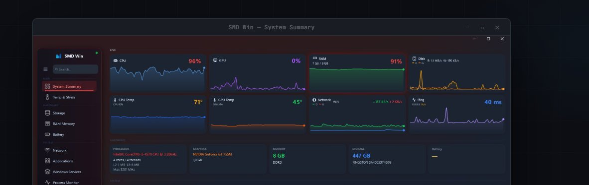

---

## Download

  
  &nbsp;
  
  &nbsp;
  
  &nbsp;
  

**Portable — no installer required.** Extract the archive and launch. .NET 8 Runtime is included in Windows 10 and 11.

---

## Features

### 📊 Hardware Monitoring
Real-time live charts for CPU, GPU, RAM, and disk usage. Color-coded alert thresholds, temperature tracking per component, and floating overlay widgets that stay visible on your desktop while you work.

### 🌡️ Temperatures & Benchmarks
CPU and GPU thermal history charts with stress test support and turbo mode control. Includes CPU frequency and power monitoring, along with a composite performance score.

### 🌐 Network Intelligence
Per-app bandwidth tracking, IP geolocation of active connections, ping monitor, traceroute, DNS lookup, and firewall & adapter management — all from one place.

### 🔬 Process Monitor
Per-process CPU, RAM, disk, and network usage with 60-second historical graphs. Supports process termination, deep analysis, and pinning any process as a live desktop widget.

### 💾 Storage & Memory
S.M.A.R.T. health status and surface scan for drives, partition overview, storage benchmark, RAM slot visualization, bandwidth test, and memory integrity testing.

### 🧰 Tools & Diagnostics
Driver scanner and update manager, space cleanup, performance optimizer, startup manager, event viewer, shutdown timer, and quick system commands.

### 🪟 Customizable Widgets
Floating desktop widgets in Graph or Gauge display mode, corner-anchored and always-on-top. Pin any process as a live widget directly from the Process Monitor.

---

## Screenshots

<table>
  <tr>
    <td align="center"><b>System Summary — Dark</b></td>
    <td align="center"><b>System Summary — Light</b></td>
  </tr>
  <tr>
    <td>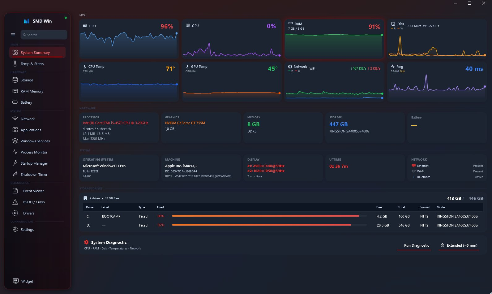</td>
    <td>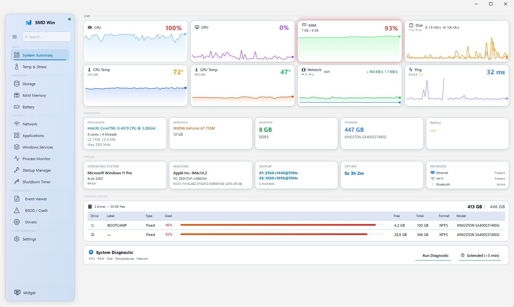</td>
  </tr>
  <tr>
    <td align="center"><b>Process Monitor</b></td>
    <td align="center"><b>RAM Memory Modules</b></td>
  </tr>
  <tr>
    <td>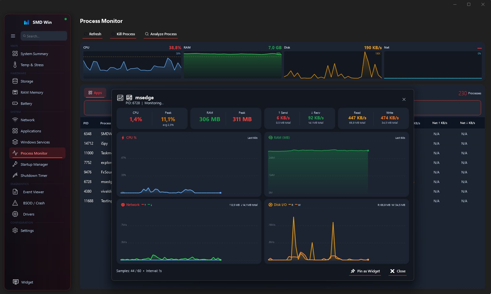</td>
    <td>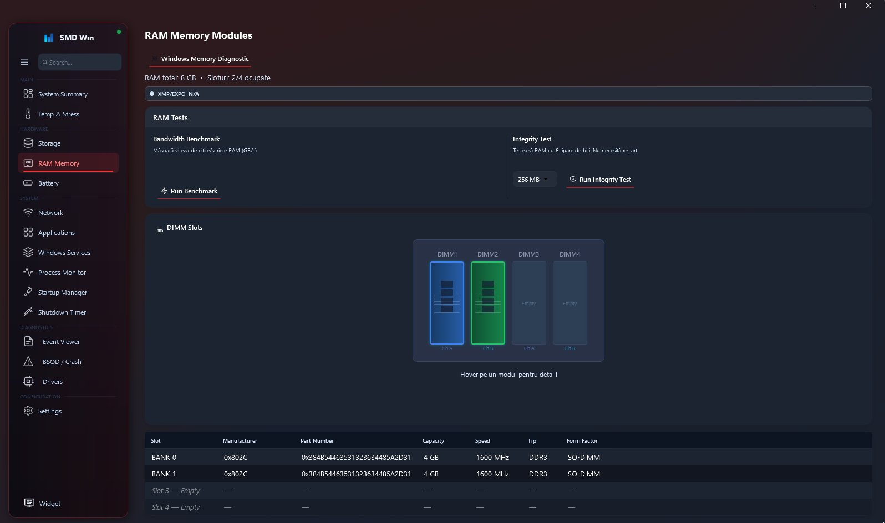</td>
  </tr>
  <tr>
    <td align="center"><b>Network — Ping Monitor</b></td>
    <td align="center"><b>Settings & Themes</b></td>
  </tr>
  <tr>
    <td>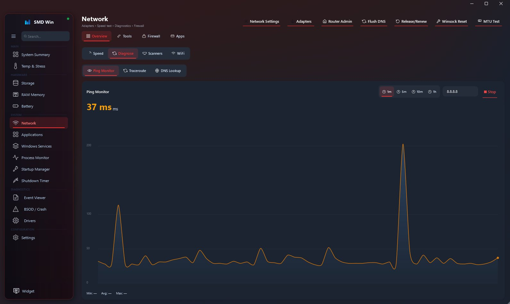</td>
    <td>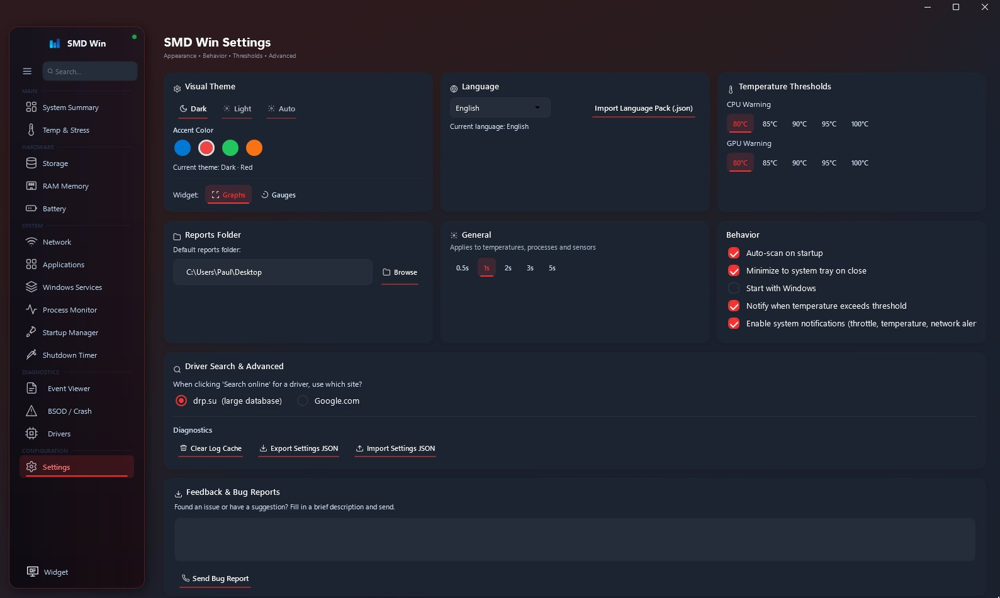</td>
  </tr>
</table>

---

## Themes

Four accent colors — **Blue**, **Red**, **Green**, and **Orange** — each available in both Dark and Light variants. An **Auto** mode follows your Windows system preference automatically.

<table>
  <tr>
    <td align="center">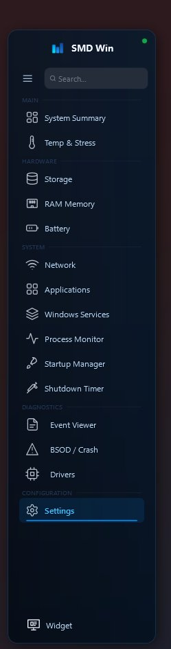 Blue</td>
    <td align="center">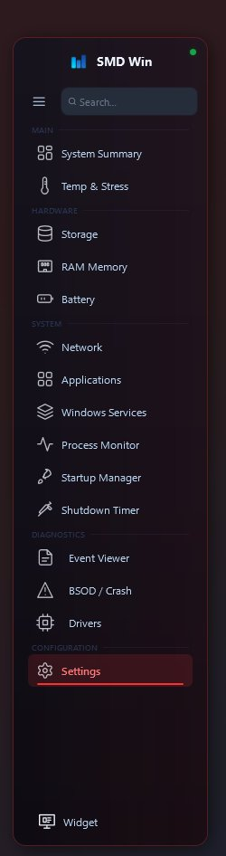 Red</td>
    <td align="center">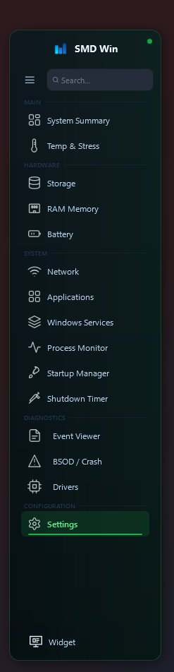 Green</td>
    <td align="center">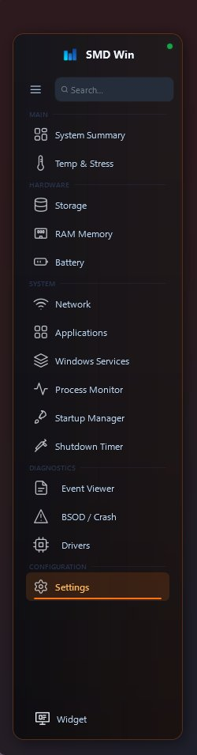 Orange</td>
  </tr>
</table>

---

## Privacy & Principles

| | |
|---|---|
| 🔓 **Open Source** | Full source code available. Review, audit, or contribute at any time. |
| 🚫 **Zero Telemetry** | No data is collected, transmitted, or stored. Your system information never leaves your machine. |
| 🛡️ **No Background Calls** | The application operates entirely offline. IP geolocation is performed only on explicit user request. |
| 💸 **Free Forever** | No paid tiers, no premium features, no subscription. |

---

## Important Notes

> **🔑 Administrator Privileges**  
> Several features require the application to run as Administrator — including system diagnostics, driver scanning, S.M.A.R.T. storage analysis, performance optimizer, and Windows Services management.

> **🎮 GPU Sensor Limitations**  
> Temperature, clock, and load readings for certain GPU models may be unavailable or inaccurate. This is a known limitation of the underlying hardware sensor APIs, particularly on some integrated GPUs and older discrete graphics cards.

> **📦 Portable Application**  
> No installer, no registry entries, no leftover files. Simply extract the archive and run. .NET 8 is included in Windows 10 and 11 and does not require a separate installation.

---

## Requirements

- Windows 10 or 11 (x64)
- .NET 8 Runtime *(bundled with Windows 10/11 — no separate download needed)*
- Administrator privileges recommended for full feature access

---

## Built With

- [WPF / .NET 8](https://dotnet.microsoft.com/) — UI framework
- [LibreHardwareMonitor](https://github.com/LibreHardwareMonitor/LibreHardwareMonitor) — hardware sensor reading

---

## License

This project is licensed under the [MIT License](LICENSE).

---

  SMD Win — <i>System Monitoring and Diagnostics for Windows</i>

